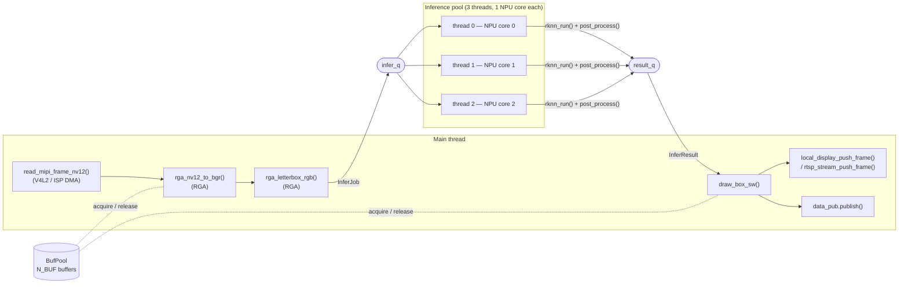
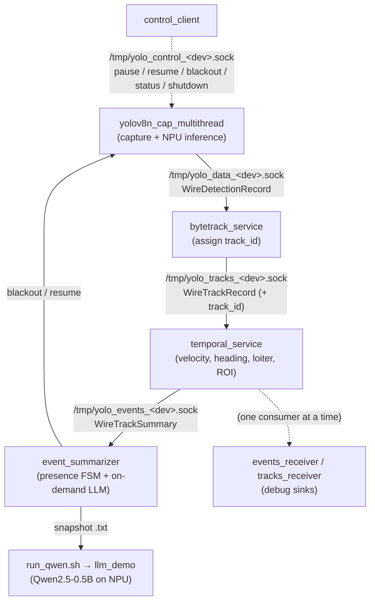

# Software architecture

Two views of the system:

1. **YOLO pipeline** — the internal multi-threaded dataflow inside a single
   `yolov8n_cap_multithread` process ([`src/main.cc`](../yolov8n_cap_multithread/src/main.cc)).
2. **Application architecture** — how the independent OS processes connect over
   Unix-domain sockets to form the full detection → tracking → temporal → LLM
   stack.

---

## 1. YOLO pipeline (inside `main.cc`)

A single process pipelines capture, inference, and display in parallel. The
**main thread** owns capture, pre-processing (RGA), drawing, and output; a pool
of **`N_THREADS = 3` inference threads** each own one RKNN context pinned to a
separate NPU core (`rknn_dup_context` + `rknn_set_core_mask`). Work flows
between them through two thread-safe FIFOs (`infer_q`, `result_q`), and a fixed
pool of `N_BUF = N_THREADS + 2` frame buffers (`BufPool`) is recycled instead of
allocating per frame.

Notes:
- Each inference thread runs `rknn_run()` then `post_process()` (YOLOv8 decode +
  NMS) and pushes an `InferResult` carrying the decoded boxes.
- The pipeline is pre-filled with `N_THREADS` frames so every core is busy from
  the first result onward.
- When paused (`inference_enabled == false`) the inference threads skip RKNN and
  emit an empty result, so display and buffer recycling keep flowing.
- On **blackout** the main thread drains in-flight jobs, calls `rknn_destroy()`
  on every context, and closes the `/dev/rknpu` fd so the NPU scheduler stops
  counting this process — handing 100% of the NPU to the LLM. `resume` re-inits
  the contexts and drains stale V4L2 frames.

### Hardware offload

Every heavy per-frame operation runs on a dedicated fixed-function block, never
on the CPU, which is why the memory footprint stays flat and bounded:

| Per-frame operation | Where it runs | Call in `main.cc` |
|---|---|---|
| Frame capture (MIPI/ISP DMA) | Camera ISP + V4L2 DMA | `read_mipi_frame_nv12()` |
| NV12 → BGR color conversion | **RGA** (2D raster engine) | `rga_nv12_to_bgr()` |
| Letterbox resize → model input | **RGA** | `rga_letterbox_rgb()` |
| YOLOv8n inference | **NPU** (3 cores) | `rknn_run()` |
| Output / RTSP / HDMI | GStreamer / DRM | `rtsp_stream_push_frame()` / `local_display_push_frame()` |

The CPU never touches pixels — no software color-conversion, resize, or
convolution — so there are no large intermediate framebuffers or scratch tensors
on the CPU side. See [docs/benchmarks.md](benchmarks.md) for the full numbers.

---

## 2. Application architecture (process topology)

Each stage is an independent OS process; they communicate via per-device
Unix-domain sockets (`<device>` = V4L2 device number, e.g. `33`). Each stage is
independent: if one stops or crashes, upstream keeps running (bounded
drop-oldest queue) and the next process down reconnects when it restarts.

Notes:
- The **data plane** (solid arrows) carries binary wire records defined in
  [`include/ipc/wire_protocol.h`](../yolov8n_cap_multithread/include/ipc/wire_protocol.h).
- The **control plane** (`/tmp/yolo_control_<dev>.sock`, dashed) is a separate
  JSON socket used by `control_client` and by `event_summarizer` to blackout /
  resume the pipeline around an LLM run.
- The `data_`, `tracks_`, and `events_` sockets each accept **one consumer at a
  time** — run either the production sink or a debug receiver, not both.

For launch commands and the full FSM / LLM workflow, see
[usage_advanced.md](usage_advanced.md).
