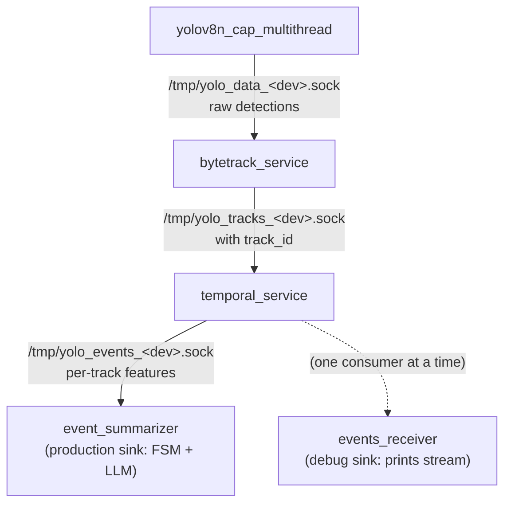
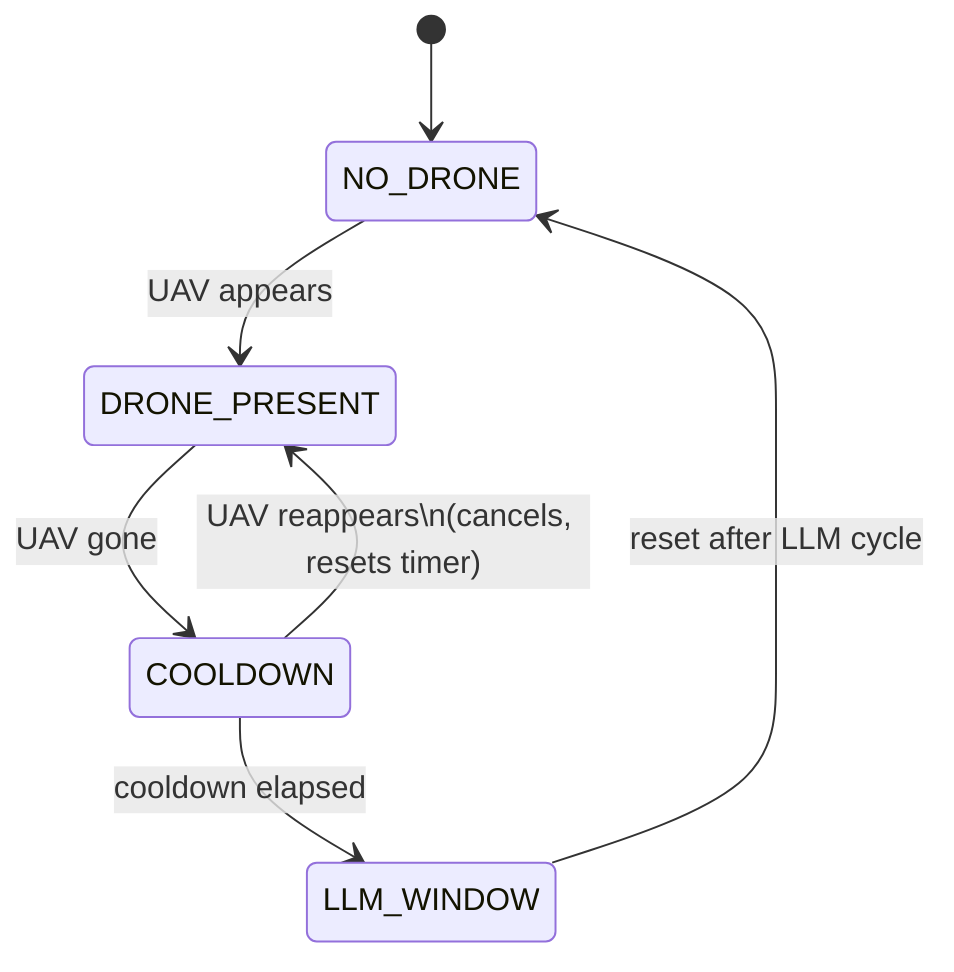

# YOLOv8n pipeline — advanced usage

Deep-dive material moved out of [usage.md](usage.md): CPU-pinning rationale,
the IPC control/data plane, the LLM context-switch workflow, the downstream
tracking/temporal/summary stages, and full-stack orchestration.

All commands run on the Khadas board. The `lib/` directory contains
`librknnrt.so` and `librga.so`; set `LD_LIBRARY_PATH` before launching.

---

## CPU pinning on the RK3588S (big.LITTLE)

The RK3588S has 8 CPU cores:

| Cores | Type | Recommended for |
|---|---|---|
| **0–3** | Cortex-**A55** (LITTLE) | single-threaded auxiliary services |
| **4–7** | Cortex-**A76** (BIG)    | `yolov8n_cap_multithread` (multi-threaded pipeline) |

The Linux scheduler is *aware* of big.LITTLE but on the vendor kernel it is
not aggressive enough to keep light services off the A76s, so explicit pinning
with `taskset` is more predictable.

**Rule of thumb**

| Process | Pinning | Why |
|---|---|---|
| `yolov8n_cap_multithread` (×N cameras) | `taskset -c 4-7` | 3 inference threads + main; needs A76 throughput |
| `bytetrack_service` | `taskset -c 0-3` | single-threaded, microseconds per frame |
| `temporal_service`  | `taskset -c 0-3` | single-threaded, tiny math |
| `data_receiver` / `tracks_receiver` / `events_receiver` | `taskset -c 0-3` | socket I/O + printf |
| `control_client`    | not needed | exits in milliseconds |

**Use a range, not a single core.** `taskset -c 0-3` lets the scheduler
migrate within the A55 cluster to whichever core is least loaded. Pinning to a
specific core (`-c 0`) is only useful for cache-sensitive hot loops, which
none of these services have.

To pin an already-running process:

```sh
taskset -cp 0-3 $(pgrep -f bytetrack_service)
```

Verify placement (the `PSR` column is the current core):

```sh
ps -eo pid,psr,comm,args | grep -E 'bytetrack|temporal|yolov8n'
```

---

## IPC — control plane and data plane

The pipeline exposes two Unix-domain sockets per instance, derived from the
device number so both cameras can run without conflict:

| Instance | Control socket | Data socket |
|---|---|---|
| camera 33 | `/tmp/yolo_control_33.sock` | `/tmp/yolo_data_33.sock` |
| camera 51 | `/tmp/yolo_control_51.sock` | `/tmp/yolo_data_51.sock` |

### control_client — send commands to a running pipeline

```sh
# Query live status (FPS, frame counter, queue depth)
./control_client 33 get_status
./control_client 51 get_status

# Pause / resume inference without stopping the pipeline
./control_client 33 pause_yolo
./control_client 33 resume_yolo

# Blackout: destroy RKNN contexts, close /dev/rknpu fd, freeze the stream.
# The main thread goes completely idle — the LLM gets 100% NPU time.
# Blocks until the pipeline confirms (typically < 100 ms).
./control_client 33 blackout
./control_client 51 blackout   # release both cameras before starting the LLM

# Resume: re-init RKNN, drain stale camera frames, restart inference.
# Blocks until the pipeline confirms (typically < 500 ms).
./control_client 33 resume
./control_client 51 resume

# Toggle raw-result dumping to stdout
./control_client 33 set_dump_enabled true
./control_client 33 set_dump_enabled false

# Graceful shutdown of a specific instance
./control_client 33 shutdown
```

#### LLM context-switch workflow

```sh
# 1. Release both cameras before launching the LLM
./control_client 33 blackout
./control_client 51 blackout

# 2. Run the LLM — it now has the full NPU to itself.
#    Pin to the BIG A76 cores (4-7): they are idle while YOLO is blacked out,
#    and the LLM's host-side token loop needs A76 throughput. Running it on the
#    A55 cluster (0-3) throttles generation even though the NPU is busy.
taskset -c 4-7 ./qwen ...

# 3. Hand the NPU back to the cameras when done
./control_client 33 resume
./control_client 51 resume
```

While in blackout the RTSP / HDMI stream freezes on the last frame.
The V4L2 capture keeps running in the kernel (ISP DMA) but nothing is
processed in userspace, so DDR traffic from the YOLO processes is negligible.

### data_receiver — consume detection output from a running pipeline

```sh
# Stream detections to stdout (blocks until the pipeline stops)
./data_receiver 33
./data_receiver 51

# Also print a summary line for every frame (including frames with 0 detections)
./data_receiver 33 --count
```

The receiver retries the connection automatically, so it can be started before
or after the pipeline.

> Note: the data socket accepts **one consumer at a time**. If
> `bytetrack_service` (below) is running, it occupies that slot, so run either
> `data_receiver` *or* `bytetrack_service`, not both.

---

## Tracking + temporal features (separate processes)

Two optional downstream stages chain off the YOLO data socket. Each runs as
its own process and uses the same `<device>`-derived Unix-domain-socket scheme.



> The events socket accepts **one consumer at a time**. Run *either*
> `event_summarizer` (production) *or* `events_receiver` (debug) against a
> given `/tmp/yolo_events_<dev>.sock`, not both.

| Instance | Tracks socket | Events socket |
|---|---|---|
| camera 33 | `/tmp/yolo_tracks_33.sock` | `/tmp/yolo_events_33.sock` |
| camera 51 | `/tmp/yolo_tracks_51.sock` | `/tmp/yolo_events_51.sock` |

Each stage is **independent**: if it stops or crashes, upstream keeps running
(bounded queue, drop-oldest), and the next process down will reconnect when it
restarts.

### bytetrack_service — assign track IDs

Pin to the A55 cluster so it never competes with YOLO inference on the A76s.

```sh
cd ~/programs/yolov8n_cap_multithread
taskset -c 0-3 ./bytetrack_service 33
taskset -c 0-3 ./bytetrack_service 51
```

### tracks_receiver — inspect tracked detections (debug)

```sh
taskset -c 0-3 ./tracks_receiver 33                # only frames with tracks
taskset -c 0-3 ./tracks_receiver 33 --count        # one line per frame
```

Example output:
```
frame    142  [14:22:07.318051]  2 track(s)
  id=3    UAV              conf=0.84  box=(812,440,910,512)
  id=7    UAV              conf=0.71  box=(1204,602,1280,668)
```

### temporal_service — per-track temporal features

Computes duration, visibility, velocity, heading, acceleration, loiter score,
and optional ROI enter/exit events. Output is one `WireTrackSummary` per
active (or recently-lost) track per frame.

```sh
# No ROI
taskset -c 0-3 ./temporal_service 33

# With a rectangular ROI in pixel coordinates: L,T,R,B
taskset -c 0-3 ./temporal_service 33 --roi 400,200,1500,800
```

### events_receiver — consume the temporal summary stream

```sh
taskset -c 0-3 ./events_receiver 33
taskset -c 0-3 ./events_receiver 51
```

Example output (one line per track per frame):
```
f=142   id=3    UAV          ACTV dur=1840ms vis=0.97 c=( 861, 476) v=(+42.3,-15.1) sp= 44.9 hd=-19.7° a= +5.2 loit=0.00 roi=I
f=142   id=7    UAV          TENT dur=  66ms vis=1.00 c=(1242, 635) v=( +0.0, +0.0) sp=  0.0 hd= +0.0° a= +0.0 loit=0.00 roi=-
```

Column legend:
- **status** — `TENT` (just appeared, <3 obs), `ACTV` (active), `LOST` (not seen this frame)
- **vis** — visibility = frames_seen / frames_since_first
- **v** — (vx, vy) px/s, EMA-smoothed
- **sp** — speed px/s, **hd** — heading degrees
- **a** — acceleration px/s²
- **loit** — loiter score 0 (moving) → 1 (stationary)
- **roi** — `-` outside, `I` inside, `E` entered this frame, `X` exited this frame

### event_summarizer — presence FSM + on-demand LLM summary

The production sink for the events stream. It aggregates per-track
`WireTrackSummary` records into one rolling record per `track_id`, runs a
dead-simple presence FSM, and — once a UAV has left the scene for a configured
cooldown — **blackouts** YOLO (fully releasing the NPU), writes an LLM-friendly
snapshot, runs Qwen once, then resumes YOLO.

FSM states:



A UAV counts as "present" when at least one summary in the current frame has
`class_name == UAV` (the label in `data/coco_1_labels_list.txt`) and
`status != LOST`. A brief tracker dropout during `COOLDOWN` does **not**
re-trigger the LLM — the cooldown debounces it.

```sh
# Snapshot-only (no LLM, no blackout) — good for first checks
taskset -c 0-3 ./event_summarizer 33 --no-control

# Full workflow: 30 s cooldown, blackout BOTH cameras, run Qwen via the wrapper
taskset -c 0-3 ./event_summarizer 33 \
    --cooldown-s 30 \
    --also-device 51 \
    --qwen-cmd "$HOME/programs/yolov8n_cap_multithread/utility_board_scripts/run_qwen.sh"
```

Options:
- `--cooldown-s N`   seconds the UAV must be absent before triggering (default 30)
- `--drone-class S`  class label that counts as a UAV (default `UAV`)
- `--out PATH`       snapshot text file (default `/tmp/yolo_summary_<dev>.txt`)
- `--qwen-cmd CMD`   command run once after the snapshot; the snapshot path is
                     appended as the final argument. Omit to skip the LLM step.
- `--also-device D`  additional camera to blackout/resume around the LLM run
                     (repeatable). Use it for the other camera so the LLM gets
                     the whole NPU.
- `--no-control`     do not send blackout/resume (debug; just summarize)

The snapshot is written atomically (`*.tmp` + `rename`) so Qwen never reads a
half-written file. `run_qwen.sh` pipes it into `llm_demo` and writes the reply
to `/tmp/yolo_summary_<dev>.reply.txt`.

> **Core pinning — why `event_summarizer` is on `0-3` but the LLM still runs
> on `4-7`:** the summarizer itself is a light socket consumer + FSM, so it is
> pinned to the A55 cluster (`0-3`) like the other receivers. When it triggers
> the LLM it calls `run_qwen.sh` via `std::system()`, which forks a child that
> *inherits* the `0-3` mask. `run_qwen.sh` therefore **re-pins `llm_demo` to
> the big A76 cores (`4-7`)** with its own `taskset` (override via `QWEN_CPUS`).
> Those cores are idle while YOLO is blacked out, so the LLM gets full
> throughput even though its parent is on the little cores. Without that
> re-pin the LLM's host-side token loop would crawl on the A55s (the NPU lights
> up but generation stalls).

> **NPU note:** the summarizer sends `blackout`/`resume` (not
> `pause_yolo`/`resume_yolo`). `blackout` destroys the RKNN contexts and closes
> `/dev/rknpu`, which is what frees enough throughput for the LLM (~35 tok/s);
> plain pausing keeps the contexts loaded and is too slow. With two cameras,
> pass `--also-device 51` so **both** are released before Qwen runs.

---

## Full stack — one camera

YOLO on the A76 cluster, all downstream stages on the A55 cluster.

**Option A — one terminal for the downstream pipeline (recommended)**

Run the three downstream services in the background from a single shell.
`trap` ensures Ctrl-C tears them all down cleanly, and `wait` blocks until
they exit.

```sh
# Term 1 — YOLO on BIG cores
export LD_LIBRARY_PATH=./lib
taskset -c 4-7 ./yolov8n_cap_multithread ./data/model/best_yolov8n_800_relu.rknn 33 hdmi

# Term 2 — bytetrack + temporal + events_receiver, all on LITTLE cores
trap 'kill 0' INT TERM EXIT
taskset -c 0-3 ./bytetrack_service 33                              &
taskset -c 0-3 ./temporal_service  33 --roi 400,200,1500,800       &
taskset -c 0-3 ./events_receiver   33                              &
wait
```

Notes:
- `kill 0` signals every process in the shell's process group, so one Ctrl-C
  stops all three.
- Each service prints its own log lines to the shared stdout. To separate
  them, redirect to files (e.g. `./bytetrack_service 33 >bt.log 2>&1 &`).
- `events_receiver` is the foreground-style consumer; for the production sink
  swap it for `event_summarizer` (FSM + LLM):

```sh
# Term 2 — production downstream: bytetrack + temporal + event_summarizer
trap 'kill 0' INT TERM EXIT
taskset -c 0-3 ./bytetrack_service 33                              &
taskset -c 0-3 ./temporal_service  33 --roi 400,200,1500,800       &
taskset -c 0-3 ./event_summarizer  33 --cooldown-s 30 \
    --also-device 51 \
    --qwen-cmd "$PWD/utility_board_scripts/run_qwen.sh"           &
wait
```

**Option B — one terminal per stage** (useful for debugging a single service)

```sh
# Term 1
taskset -c 4-7 ./yolov8n_cap_multithread ./data/model/best_yolov8n_800_relu.rknn 33 hdmi
# Term 2
taskset -c 0-3 ./bytetrack_service 33
# Term 3
taskset -c 0-3 ./temporal_service  33 --roi 400,200,1500,800
# Term 4
taskset -c 0-3 ./events_receiver   33
```

You can start them in any order — each downstream service retries until its
upstream socket appears.
